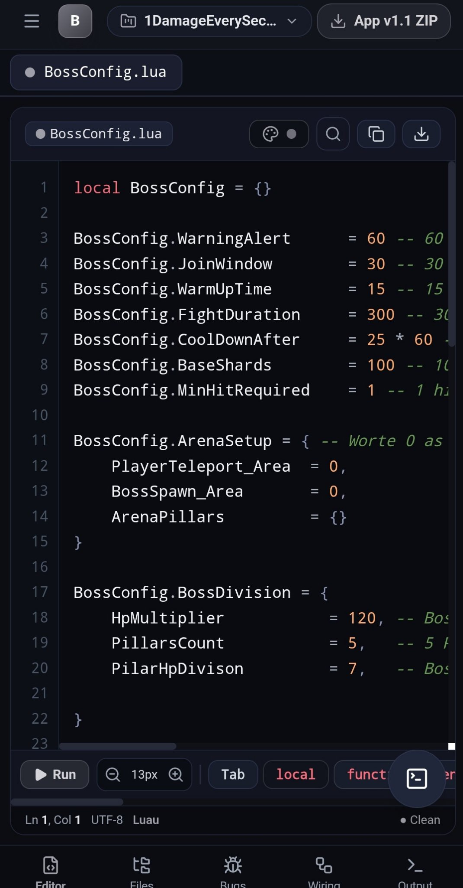
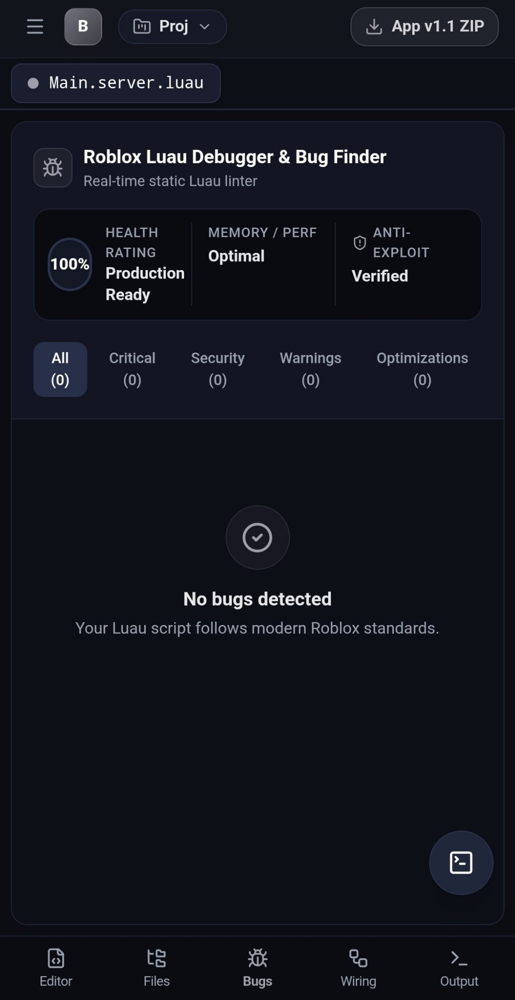
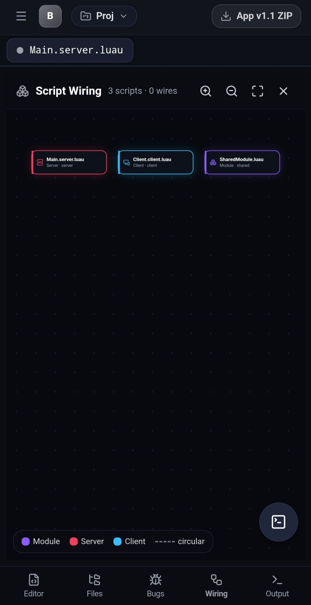
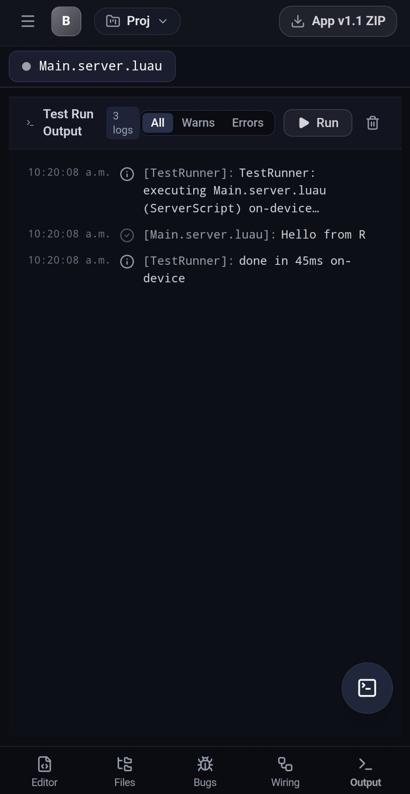
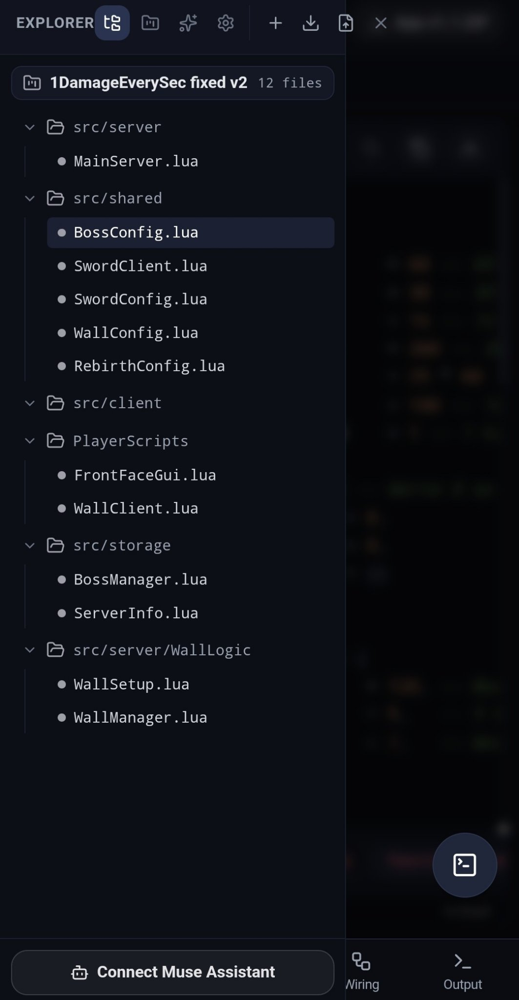
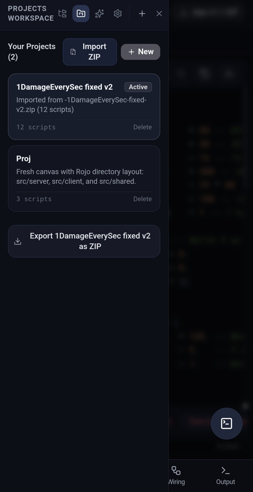

# BloxCraft Studio — Roblox Luau Coding Workspace

A clean, mobile-first coding workspace for Roblox Luau. Write, debug, test, and
ship Roblox scripts from your phone or desktop — no Roblox Studio required.

## Features

- **Code editor** — syntax-highlighted Luau editor with tabs, file explorer, and multi-file projects
- **Real bug finder** — static Luau linter with one-tap auto-fix and Fix All
- **On-device test runner** — execute Luau with Fengari (mocked Roblox engine), right on your phone
- **Wiring diagram** — visualize script dependencies (require graph) with pan/zoom
- **Bring-your-own AI** — connect OpenAI, DeepSeek, Anthropic, Gemini, OpenRouter,
  any OpenAI-compatible endpoint, or **Ollama on localhost** (e.g. DeepSeek running
  in Termux). Your key never leaves your device.
- **Ustaad link** — pair with the Ustaad assistant, share your project as a file,
  and apply AI-suggested edits back with one tap
- **GitHub sync** — device-flow login, push/pull projects per-project
- **Smart import** — bring in `.lua`/`.luau` files or whole `.zip` projects
  (Rojo and Studio service layouts auto-mapped to `src/server`, `src/client`, `src/shared`)
- **Monochrome UI** — black & grey, distraction-free, built mobile-first

## Get the app

Download the latest signed APK from
[Releases](https://github.com/Pannu2009/bloxcraft-roblox-luau-studio/releases)
or the **BloxCraft-AI-Luau-Studio-APK** artifact on the latest successful
[Actions run](https://github.com/Pannu2009/bloxcraft-roblox-luau-studio/actions).

> Sideloaded APKs may trigger a Play Protect warning — this is normal for
> apps not distributed through the Play Store.

## Screenshots

| Editor | Debugger | Wiring |
|---|---|---|
|  |  |  |

| Test output | Explorer | Projects |
|---|---|---|
|  |  |  |

## Run your own AI locally (Termux + Ollama)

1. In Termux:
   ```sh
   pkg install ollama
   ollama serve &
   ollama pull deepseek-r1:8b
   ```
2. In BloxCraft, open the **AI Assistant** tab → provider **Ollama (localhost)**.
3. Base URL stays `http://localhost:11434/v1`, model `deepseek-r1:8b`.
4. Chat, and tap **Apply** on any code block to write it into your script.

Full guide (models for phones, cloud keys, chat context, sharing files):
[`docs/ai-models.md`](docs/ai-models.md).

## Develop

```sh
npm install
npm run dev        # web dev server
npm run build      # production web build
```

### Android APK

```sh
npm run build
npx cap sync android
cd android && ./gradlew assembleRelease
```

CI builds and signs the release APK automatically on every push to `main`
(see `.github/workflows/build-apk.yml`). Signing secrets required:
`ANDROID_KEYSTORE_BASE64`, `ANDROID_KEYSTORE_PASSWORD`, `ANDROID_KEY_ALIAS`,
`ANDROID_KEY_PASSWORD`.

## Project structure

```
src/
  components/   # UI: editor, explorer, debugger, assistant, modals…
  utils/        # linter, zip import/export, GitHub sync, AI providers, Luau runner
  types/        # RobloxProject / ScriptFile models
  data/         # project templates
android/        # Capacitor Android shell
```

## Roadmap

- Roblox Studio plugin for two-way sync
- More linter rules & auto-fixes
- Cloud backup / multi-device sync

## License

Private project — all rights reserved for now.
